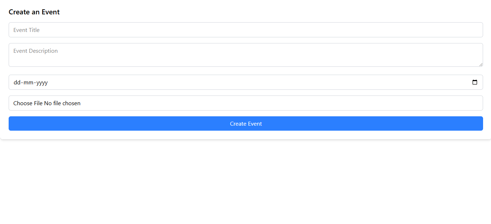

# Event Management Platform

This application allows users to create, join, and manage events. The app includes authentication and authorization using **JWT** and **bcrypt**, with a guest login option to view limited features and provides real-time update on attendees using socket.io

## ✨ Features
- **Authentication & Authorization:** Users can register, log in, and access protected routes.
- **Guest Login:** Allows limited access to event details.
- **Event Creation & Management:**
  - Only **authorized users** can create events.
  - **Creators** can **edit** or **delete** their own events.
  - Other users can **join** or **leave** events.
  - Non-creators **cannot** see the edit/delete buttons.
- **Real-time Attendee Updates:** Uses **Socket.io** to update the number of attendees in real time.

## 🚀 Tech Stack
- **Frontend:** React.js, Vercel
- **Backend:** Node.js, Express.js, MongoDB, Render
- **Authentication:** JWT, bcrypt
- **Real-time:** Socket.io

## 🖼️ Screenshots
| Create Event | Event List | Login |
|-------------|-----------|--------|
|  |  |  |

## 🌍 Deployment
- **Frontend:** [Vercel](https://swissmote-frontend-three.vercel.app/)
- **Backend:** [Render](https://swissmote-backend-nm3a.onrender.com/)